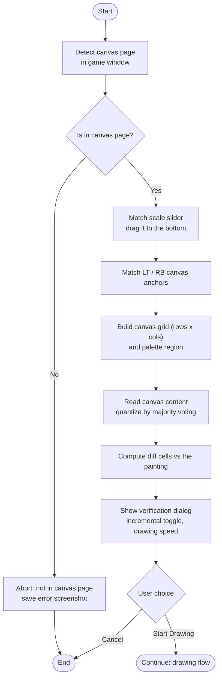
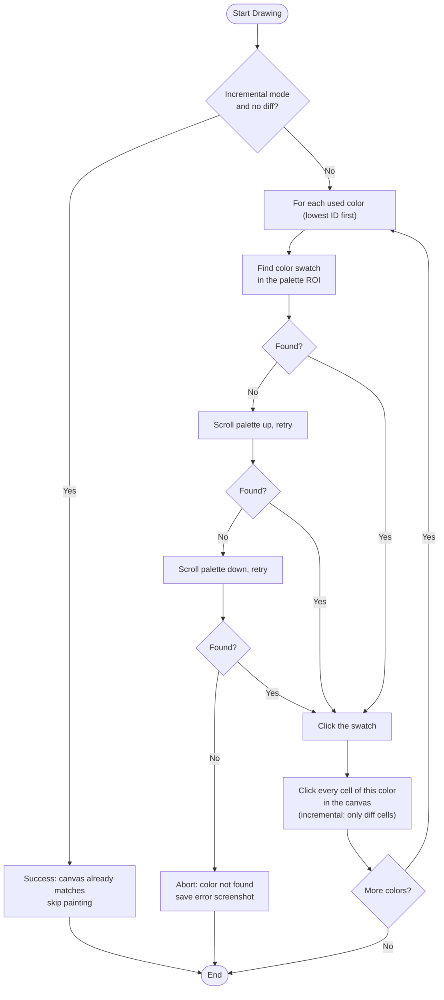

<!-- 欢迎阅读 Ark-Picit 说明文档 -->
<div align="center" style="text-align:center">
   <h1> Ark-Picit </h1>
   <p>
      Arknights Pixel Art Painter | 明日方舟奇象巡展像素画创作工具 <br>
      <code><b> v0.1.0 </b></code>
   </p>
   <p>
      
      
   </p>
</div>

## 介绍 <sub>Intro</sub>

### 项目定位

ArkPicit 是一个基于 PySide6 的面向《明日方舟》奇象巡展绘画模式的像素画创作工具。它提供了一套完整的像素画编辑器，用户可以基于预设的规则集来创作像素画，并通过 ArkPicCode 分享自己的作品。

### 实现的功能

1. **像素画编辑器**：复原了游戏中的像素画编辑器功能，也可以本地保存、浏览和编辑已有画作。
  
2. **从图片智能创建**：从本地文件或剪贴板导入图片，通过交互式裁切、多种采样方式（最近邻/双线性/双三次）与选色方式（RGB 线性/平方误差、灰阶、多数投票）将图片自动转换为像素画。

3. **ArkPicCode 分享码**：每幅画作可编码为一段 Base64 文本分享码，在程序内输入分享码即可一键导入他人作品。

4. **游戏内自动作画**：连接游戏窗口（Win32）或模拟器（adb）后，自动完成区域校准、画布差异计算与逐色绘制，支持增量模式与绘制速度调节。此外，也支持识别游戏画布当前内容并载入编辑器中，作为新画作继续创作。

5. **联网功能**：连接服务端后，可在探索页浏览并导入他人作品。

## 使用方法 <sub>Usage</sub>

本项目使用 **Python 3.12** 进行开发。推荐使用 uv 来安装依赖：

```bash
uv sync --group dev
```

如果要运行 API 服务端，则需要额外安装服务端依赖组：

```bash
uv sync --group server
```

随后在 uv 创建的虚拟环境中运行：

```bash
python main.py                 # 启动客户端（GUI）
python main.py --server        # 如需启动 API 服务端
```

启动服务端前必须先创建配置文件（见下文「服务端」章节），否则服务端会报错退出。生产环境部署仅适用于受信网络或 TLS。

## 开发 <sub>Development</sub>

### 技术栈

| 层        | 技术                                  |
| :-------- | :------------------------------------ |
| 语言      | Python 3.12                           |
| GUI 框架  | PySide6 6.11 + pyside6-fluent-widgets |
| 图像处理  | OpenCV + NumPy                        |
| API服务端 | FastAPI + uvicorn + SQLModel + SQLite |

### 核心数据模型

#### ArkPicRule

一个 ArkPicRule 对象表示一套像素画规则，包括画幅尺寸、色板定义和默认色。

- 色板中的颜色为十六进制字符串（"RRGGBB" 格式），ID 从 1 开始计算，最多支持 255 种颜色。
- 规则哈希用于高效比较两套像素画规则是否一致，参与运算的元素是色板中的所有颜色值以及默认色 ID。

```
ArkPicRule
  ├── width / height    画幅尺寸 (1-255)
  ├── colors[]          色板
  ├── default_color_id  默认色 ID
  └── color_hash        规则哈希 (CRC-16/CCITT)
```

#### ArkPic

一个 ArkPic 对象表示一副基本像素画。每个像素画必须绑定一个 ArkPicRule，以便确定画幅尺寸和色板信息。

```
ArkPic
  ├── rule        绑定的 ArkPicRule
  └── grid[y][x]  2D 像素网格 (填充颜色 ID，不允许为空值或零值)
```

#### ArkPicCode

ArkPicCode 是一种 URL Safe Base64 文本编码，用于分享画作。原始字节流先经过 zlib 压缩再编码，字节流的格式如下：

```
[U8 width] [U8 height] [U16 rule_hash] // 画幅尺寸和规则哈希
[U8 name_len] [name_bytes...] // 画作名称，UTF-8 编码，0-255 字节
[U8 desc_len] [desc_bytes...] // 画作描述，UTF-8 编码，0-255 字节
[U8 × (width × height)] // 平展后的像素颜色 ID，保证均为非零值
[0x00] // 终止字节
```

解码程序需要拥有相同 `color_hash` 的 `ArkPicRule` 才能将像素 ID 映射回具体颜色，这保证了分享码在不同规则集之间不会混淆。

### 目录结构

```
Ark-Picit/
├── main.py       # 统一启动入口
├── client/       # 客户端
│   ├── main.py   # 客户端入口
│   ├── assets/   # 自动化模板图像
│   └── src/
│       ├── app/      # 主窗口、设备管理、网络层、API 客户端、信号总线
│       ├── auto/     # 自动化：设备抽象、模板/颜色匹配、Automator 门面
│       ├── core/     # 数据模型、ArkPicCode 编解码、量化、存储、游戏内任务
│       ├── gui/      # GUI 页面、控件、对话框
│       └── utils/    # 路径等工具
├── server/           # API 服务端
│   └── src/          # 路由、校验、鉴权、解析、存储
└── data/             # 运行时数据（启动时生成）
    ├── arkpicit_client_v1/
    └── arkpicit_server_v1/
        ├── config.toml   # 服务端配置（必需，需手动创建）
        └── server.db     # SQLite 数据库（首次启动时生成）
```

### 客户端

#### 自动绘图流程

「自动作画」功能通过 `src/auto` 自动化包驱动游戏窗口完成游戏内像素画绘制。整体流程拆分为两个阶段：区域校准与验证、自动绘制。区域校准与画布内容读取（`src/core/tasks`）同时被「从游戏画布导入」功能复用。

**图 1：区域校准与验证**



**图 2：自动绘制**



#### 实现细节注意事项

1. **模板缩放约定**：模板按固定短边（720p）采集，属于归一化空间资产，运行时永不缩放模板；匹配时把设备截图缩放到归一化空间再原样匹配。

2. **模板匹配的方差陷阱**：`cv2.matchTemplate`（TM_CCOEFF_NORMED）对纯色零方差输入是未定义行为，会返回假阳性，因此须对模板做标准差守卫并对分数做有限性检查。纯色色块（如色板取色）不能走模板匹配，应使用颜色敏感匹配。

3. **Win32 光标纪律**：仅在 Win32 控制器中，游戏通常会读取 `GetCursorPos`，因此每次点击/拖动前必须把真实光标精确移动到目标像素；截图前把光标停在窗口客户区右下角并等待一小段时间，防止鼠标光标污染画面。瞬时点击会被部分情景漏检，需通过 `hold_ms` 参数保持按压。

4. **Win32 截图纪律**：Win32 以非管理员模式运行程序时，后台模式下 `PrintWindow` 可能会返回全黑画面，会自动回退到 `BitBlt` 截屏。尽量确保程序是以管理员方式运行。

5. **随机化纪律**：自动化流程中唯一允许的随机化是 `random_ratio`（中心 p% 区域均匀随机），仅用于 `click_region`/`click_match`/`click_template`；滑条与色板的拖动采用点对点精确，不引入任何随机。

6. **画布读取的投票量化**：从游戏画布读取内容（绘制前的差异计算、画布导入）使用投票降采样：每个目标格统计源区域内出现次数最多的精确像素颜色，平票时取众数颜色的算术平均。格子边框与水印文本因此被自然压制，无需容差参数。

7. **ADB 自动发现**：当 `adb` 不在 PATH 时，通过枚举运行中的模拟器进程（MuMu/雷电/夜神/BlueStacks/MEmu/AVD）并从进程目录解析其自带的 adb 可执行文件，PATH 仅作最后兜底。此功能借鉴了 [MaaAssistantArknights](https://github.com/MaaAssistantArknights/MaaAssistantArknights)（AGPL-3.0）与 [MaaFramework](https://github.com/MaaAssistantArknights/MaaFramework)（LGPL-3.0）的模拟器发现逻辑。

8. **对话框实现纪律**：自定义对话框应继承普通 `QDialog`（参考 `SmartCreateDialog`）。切勿混用 qfluentwidgets 的 `Dialog`（FluentDialog）与 `MessageBox`/`MessageBoxBase`——Windows 上先打开前者会使后续后者对话框永久卡死（`exec()` 无法返回）。

9. **公告去重弹窗**：客户端启动完成 handshake 后拉取 `GET /api/meta/announcement`。若整组公告的 SHA-256 哈希与本地配置记录的 `announcementHash` 不同，则立即弹出公告弹窗（关闭按钮 3 秒内不可用）并更新本地哈希；哈希一致则不再弹窗。

### 服务端

服务端依赖 `server` 依赖组（FastAPI / uvicorn / SQLModel），数据存于 SQLite。服务端不再接受任何命令行参数或环境变量，全部配置均来自配置文件。

#### 配置文件

启动前必须先创建配置文件，否则服务端会直接报错退出。配置文件路径固定为服务端数据目录下的 `config.toml`（与数据库同目录）：

```
data/arkpicit_server_v1/config.toml
```

文件为 [TOML](https://toml.io) 格式，以下字段必填：

| 字段                    | 说明                                                                    |
| :---------------------- | :---------------------------------------------------------------------- |
| `port`                  | 监听端口（整数）                                                        |
| `admin_token`           | 管理员口令，用于鉴权管理端 API（非空字符串）                            |
| `upload_default_status` | 新上传画作的初始状态：`0` 正常 / `1` 审核中 / `2` 已删除 / `3` 监管删除 |

可选字段：

| 字段                            | 默认值    | 说明                         |
| :------------------------------ | :-------- | :--------------------------- |
| `host`                          | `0.0.0.0` | 监听地址                     |
| `max_payload_length`            | `200000`  | 请求体最大字节数             |
| `max_page_size`                 | `200`     | 探索列表单页最大条数上限     |
| `max_rate_credits_per_ip_per_m` | `64`      | 每个 IP 每分钟可用的请求积分 |
| `max_rate_credits_per_ip_per_h` | `1024`    | 每个 IP 每小时可用的请求积分 |

若文件缺失、TOML 语法错误或缺少必填字段，服务端均会报错退出。

示例：

```toml
# Basic
host = "0.0.0.0"
port = 7999
admin_token = "change-me"
upload_default_status = 1

# Limits
max_payload_length = 131072
max_page_size = 50
max_rate_credits_per_ip_per_m = 64
max_rate_credits_per_ip_per_h = 1024
```

启动：

```bash
uv sync --group server
python main.py --server
```

#### 权限约束

- **client token**：每次启动后客户端先访问 `GET /api/meta/handshake`，服务端签发并记录 token。仅上传、删除与 Mine 列表等需要 client token 的请求会等待该 handshake 往返完成后再发出（服务端不可达时请求直接中止）。
- **权限字段**：探索列表响应带顶层 `can_feedback`（评价/举报权）、`can_edit`（删除权）、`can_manage`（状态修改权），客户端据此决定画作详情对话框中的操作行。
- **状态（status）**：`0` 正常展示、`1` 审核中、`2` 已主动删除、`3` 已因监管删除。Random 模式不返回 status 字段；Mine 列表排除 `status=2` 的画作。
- 评分与举报按来源 IP 去重。

#### 请求限制

- **速率限制**：按来源 IP 使用内存滑动窗口限流。每个请求按端点「速率限制乘数」消耗积分，同时受每分钟与每小时两个共享预算约束，任一超限即返回 `429`。
- **载荷限制**：请求体大小不得超过配置的 `max_payload_length`，超限返回 `413`。

#### API 端点

| 请求方法与路径                | 速率限制乘数 | 额外头部                                       | 参数或载荷                                                                                                       | 响应说明                                                      |
| :---------------------------- | :----------- | :--------------------------------------------- | :--------------------------------------------------------------------------------------------------------------- | :------------------------------------------------------------ |
| `GET /api/meta/handshake`     | 1            | 可选 `X-Client-Token`                          | —                                                                                                                | `{version, token}`；未传或无效 token 时签发新 token           |
| `POST /api/meta/handshake`    | 2            | —                                              | `token`                                                                                                          | `{"admin": bool}`；与配置文件的 `admin_token` 匹配时为 `true` |
| `GET /api/meta/announcement`  | 1            | —                                              | —                                                                                                                | `{announcements: [string, ...]}`；当前公告列表                |
| `POST /api/meta/announcement` | 2            | `X-Admin-Token`                                | `["公告1", "公告2"]`（字符串数组）                                                                               | 整体替换公告列表；非管理员 403                                |
| `GET /api/explore/list`       | 4            | mine：`X-Client-Token`；admin：`X-Admin-Token` | `mode`、`page_size`；mine 另支持 `page_number`；admin 另支持 `page_number`、`include_status`、`sort_by`、`order` | `{artworks, total, can_feedback, can_edit, can_manage}`       |
| `POST /api/explore/rating`    | 8            | —                                              | `content`, `value`                                                                                               | 重复评分 409、画作不可见 404、非法值 422                      |
| `POST /api/explore/report`    | 8            | —                                              | `content`, `reason`                                                                                              | 重复举报 409、画作不可见 404、非法理由 422                    |
| `POST /api/explore/audit`     | 2            | `X-Admin-Token`                                | `content`, `new_status`                                                                                          | 非管理员 403                                                  |
| `PUT /api/explore/work`       | 16           | `X-Client-Token`                               | `content`                                                                                                        | 无效 token 401、非法 ArkPicCode 400、重复发布 409             |
| `DELETE /api/explore/work`    | 2            | `X-Client-Token`                               | `content`                                                                                                        | 无效 token 401、非上传者 403、不存在或已删除 404              |

## 许可证 <sub>Licensing</sub>

本项目基于 **BSD-3 开源协议**。任何人都可以自由地使用和修改项目内的源代码，前提是要在源代码或版权声明中保留作者说明和原有协议，且不可以使用本项目名称或作者名称进行宣传推广。
